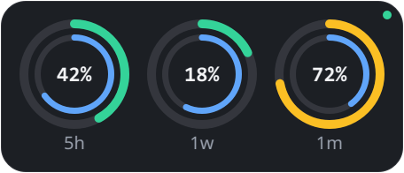
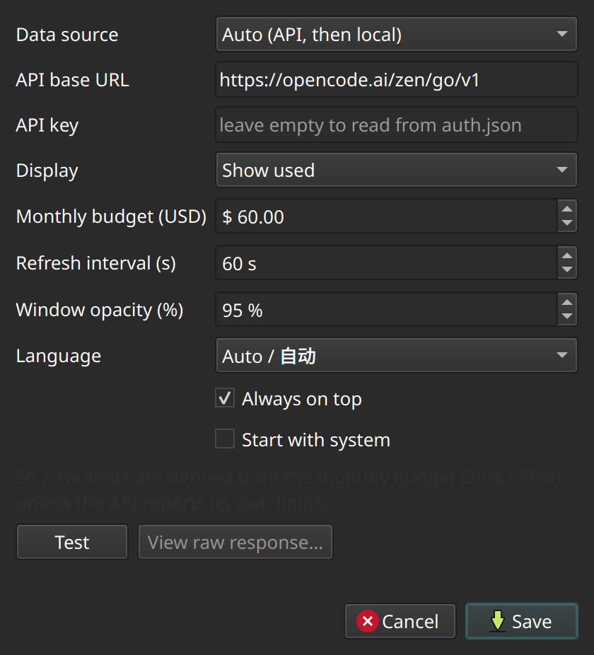

# OpencodeMonitor

A tiny always-on-top desktop widget (Linux & Windows) that shows your
opencode / OpenCode Go usage as **three double-ring dials** - 5 hours, 1 week
and 1 month.



Each dial is a double ring:

| part | meaning |
| --- | --- |
| outer ring | usage % (green → amber → red), or remaining % when enabled |
| inner ring | time left until that window resets |
| centre | usage percentage as a number |
| bottom | `5h` / `1w` / `1m` |

Left-drag moves the window, right-click opens the menu, double-click opens
settings. A tray icon offers the same actions.

## Download

Prebuilt artifacts are attached to the
[latest release](https://github.com/WilliamMarci/OpencodeMonitor/releases/latest):

| platform | file | how to install |
| --- | --- | --- |
| Windows 10/11 | `OpencodeMonitor.exe` | portable, just run it |
| Debian / Ubuntu | `opencode-monitor_<version>_amd64.deb` | `sudo apt install ./opencode-monitor_*.deb` then launch "OpencodeMonitor" from the menu |

## Quick start

Linux:

```bash
./run.sh          # creates .venv, installs PySide6, starts the widget
./run.sh --demo   # animated demo data (no opencode needed)
```

Windows:

```bat
run.bat
run.bat --demo
```

Manual install (any OS):

```bash
python3 -m venv .venv
.venv/bin/pip install -r requirements.txt
.venv/bin/python main.py
```

## Where the numbers come from

Pick a source in **Settings → Data source**:

| source | description |
| --- | --- |
| **Auto** (default) | try the Zen/Go API (if a key exists), then fall back to local opencode data |
| **Zen / Go API** | `GET https://opencode.ai/zen/go/v1/usage` with `Authorization: Bearer <key>` |
| **Local opencode data** | sum the per-message cost stored in opencode's own database |
| **Demo** | animated fake values for previewing the UI |

**No Go subscription?** Auto mode tries the API once, gets
`403 OpenCode Go subscription required`, and quietly switches to local data -
so the widget works out of the box for any provider (DeepSeek, Moonshot,
Anthropic, …). The status dot is green when live data is shown, red on error.

### Local mode

`LocalSource` reads `opencode.db` (read-only) from opencode's data directory:

- Linux: `~/.local/share/opencode/opencode.db`
- Windows: `%LOCALAPPDATA%\opencode\opencode.db`
- override with `OPENCODE_DATA_DIR`

It sums every assistant message `cost` per window:

- **5h** - rolling 5 hours; resets when the oldest charge in the window expires
- **1w** - since Monday 00:00 (calendar week)
- **1m** - since the 1st of the month (calendar month)

The per-window limits are derived from the monthly budget, matching the Go
plan's shape (`5h = 20%`, `1w = 50%`, `1m = 100%`). In API mode the limits
reported by the server are used instead.

### API key

Leave the API key empty to reuse the key opencode already stored in
`auth.json` (`opencode-go`, `opencode`). The endpoint is undocumented and its
JSON shape may change; the parser accepts common variants (percent / used /
limit / remaining / reset-in-seconds / ISO reset timestamps), and
**Settings → Test → View raw response** shows exactly what the server
returned. Parsed limits fall back to the budget shares above.

## Settings



- Data source, API base URL, API key
- Display: **used** or **remaining** (also toggleable from the right-click menu)
- Monthly budget in USD
- Refresh interval (15 s … 1 h)
- Window opacity, always-on-top
- Start with system (XDG autostart on Linux, `HKCU\...\Run` on Windows)
- Language: auto / English / 简体中文

Settings are stored with `QSettings` (INI file in the user config directory).
Position and size of the widget are remembered.

## Building release artifacts

Windows (run on Windows):

```bat
pip install -r requirements.txt pyinstaller
pyinstaller --noconfirm --clean --onefile --windowed ^
  --name OpencodeMonitor --icon assets\icon.ico main.py
rem -> dist\OpencodeMonitor.exe
```

Linux:

```bash
pip install -r requirements.txt pyinstaller
pyinstaller --noconfirm --clean --onefile --windowed --name OpencodeMonitor main.py
./packaging/build_deb.sh 0.1.0     # -> dist/opencode-monitor_0.1.0_amd64.deb
```

The icons are committed; regenerate them from the Qt painter with
`python tools/make_icons.py` (needs Pillow for the `.ico`).

## Publishing a release

Pushing a `v*` tag runs `.github/workflows/release.yml`, which builds the
Windows `.exe` and the Linux `.deb` on GitHub runners and attaches both to the
release:

```bash
git tag v0.1.0
git push origin v0.1.0
```

The workflow can also be started manually from the Actions tab
(artifact-only build, version input defaults to `0.0.0-dev`).

## Development

```bash
.venv/bin/python -m unittest discover -s tests -v   # unit tests
.venv/bin/python tools/preview.py /tmp/preview      # offscreen UI previews
```

Layout:

```
main.py                  entry point (--demo, --screenshot, --autostart)
ocmon/sources.py         local / API / demo / auto usage sources
ocmon/models.py          WindowUsage + UsageSnapshot
ocmon/dial.py            one double-ring dial (QPainter)
ocmon/widget.py          frameless always-on-top window with 3 dials
ocmon/settings.py        QSettings persistence + settings dialog
ocmon/app.py             controller: tray, timers, threading
ocmon/i18n.py            EN / 中文 strings
packaging/build_deb.sh   builds the .deb from dist/OpencodeMonitor
packaging/*.desktop      desktop entry installed by the .deb
tools/make_icons.py      regenerates assets/icon-256.png + icon.ico
.github/workflows/       release pipeline (exe + deb + GitHub release)
```
